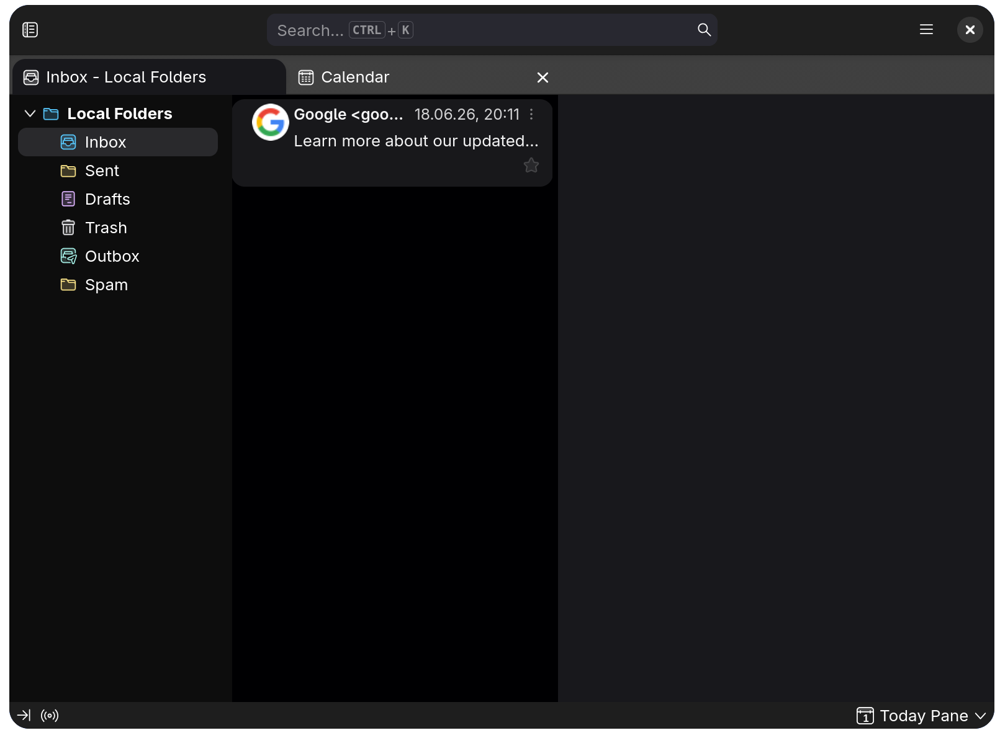
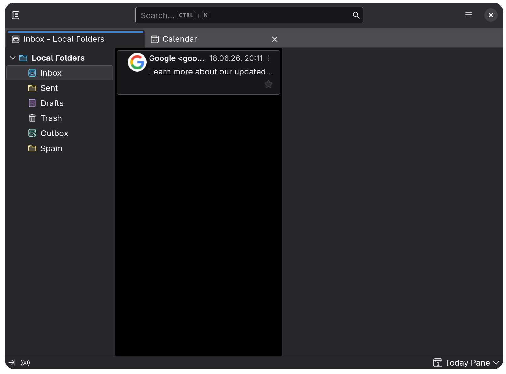

# dark-flat-rounded-thunderbird-theme

<div align="center">
	
</div>

<p align="center">A dark flat theme with rounded corners for Thunderbird.</p>

## Features

- Dark
- Flat (no borders)
- Rounded
- no thin line above tabs

#### Screenshot (with this Theme/Extension)


#### Screenshot (with the default Thunderbird Theme)


## How to install

Go to the latest [Release](), download the `dark-flat-rounded-thunderbird-theme.zip`

## How to build the Extension's .pxi file from scratch

```bash
just generate_pxi

# generates ./dark-flat-rounded-thunderbird-theme.{pxi,zip}
```

## Why does this Theme use the Thunderbird Extension API

Because simple static themes cannot customize Thunderbird beyond the provided options (see [documentation](https://developer.thunderbird.net/add-ons/web-extension-themes#static-themes)), we have to add our own `style.css` to override things like the `border-radius` and `border-width` of elements.